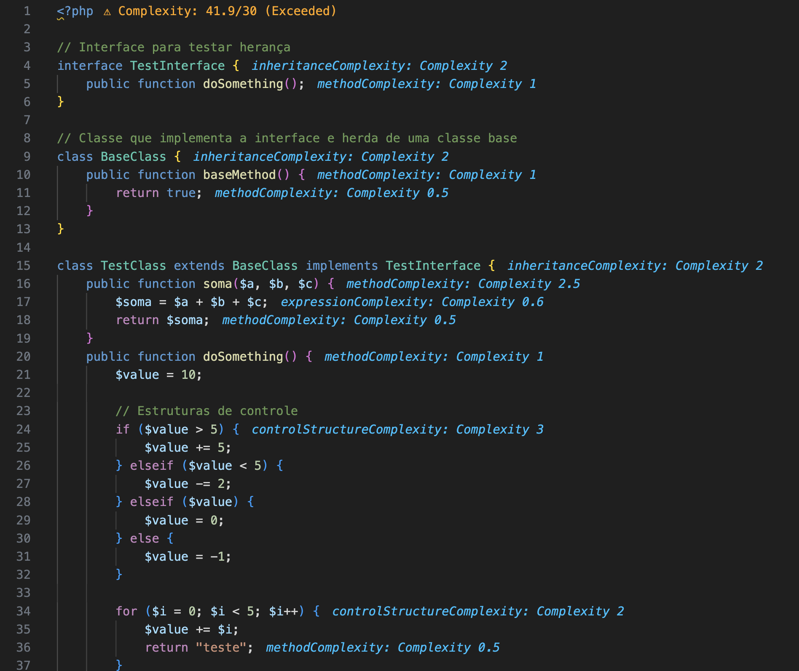

# PHP Cognitive Complexity Analyzer - Guia Rápido
🚀 **Uma extensão para análise de complexidade cognitiva em código PHP, baseada no CDD (Cognitive Driven Development).**  

## 📖 O que esta extensão faz?
A extensão **PHP Cognitive Complexity Analyzer** permite que os desenvolvedores de PHP analisem a **complexidade cognitiva** de seus arquivos, identificando **estruturas de código que aumentam a carga mental**.

Com essa análise, é possível melhorar a legibilidade e a manutenção do código, reduzindo **excesso de aninhamentos, operadores complexos e retornos dentro de estruturas condicionais**.

### 🔹 Principais Recursos:
- 🔍 **Análise de Complexidade Cognitiva** baseada em AST (Abstract Syntax Tree).
- 🎨 **Notações visuais** no código-fonte indicando a complexidade de cada estrutura.
- ⚠️ **Alertas e diagnósticos** no VS Code quando a complexidade excede os limites definidos.

### **🔍 Exemplo de Notação Visual**


---

## ⚙️ 1. Configuração
Após instalar, a extensão precisa de um arquivo JSON de configuração para definir **os pesos e limites de complexidade**.

### 📌 Criando o arquivo de configuração
1. **Execute a extensão** no seu projeto (explicação no próximo passo).
2. A extensão **automaticamente criará o arquivo** `complexity-config.json` na raiz do projeto.
3. **Edite o arquivo conforme sua necessidade.**  

### 📌 Exemplo de `complexity-config.json`
```json
{
    "totalFileComplexity": {
        "maxComplexity": 50,
        "indices": {
            "controlStructureComplexity": {
                "maxComplexity": 3,
                "weights": { "if": 1, "for": 2, "while": 2, "switch": 3, "foreach": 2, "elseif": 2 }
            },
            "tryCatchComplexity": {
                "maxComplexity": 5,
                "weights": { "try": 3, "catch": 2 }
            },
            "inheritanceComplexity": {
                "maxComplexity": 3,
                "weights": { "class": 2, "interface": 2 }
            },
            "functionComplexity": {
                "maxComplexity": 5,
                "weights": { "function": 1, "parameters": 0.5, "return": 0.5 }
            },
            "methodComplexity": {
                "maxComplexity": 5,
                "weights": { "method": 1, "parameters": 0.5, "return": 0.5 }
            },
            "expressionComplexity": {
                "maxComplexity": 2,
                "weights": { "ternary": 1, "logicalOperators": 0.5, "arithmeticOperators": 0.3 }
            }
        }
    }
}
```
Esta extensão também adiciona as seguintes configurações:

| Configuração | Tipo | Padrão | Descrição |
|-------------|------|--------|-----------|
| `phpComplexityAnalyzer.language` | `string` | `"en"` | Define o idioma das mensagens da extensão (`"pt"` para Português e `"en"` para Inglês). |

### **📌 Como Alterar as Configurações**
1️⃣ **Abrir o VS Code**\
2️⃣ Ir para **"Configurações"** (`Ctrl + ,` no Windows/Linux ou `Cmd + ,` no macOS). Ou "File" -> "Preferences" -> "Settings".\
3️⃣ Procurar por **"PHP Complexity Analyzer"** e modificar os valores.\
4️⃣ **Alternativamente**, edite o arquivo `settings.json`:

```json
{
    "phpComplexityAnalyzer.language": "en"
}
```

---

## 🏗 2. Como Usar?
A extensão pode ser executada manualmente em qualquer arquivo PHP dentro do VS Code.

1. **Abra um arquivo PHP no editor.**
2. Pressione `Ctrl+Shift+P` (Windows/Linux) ou `Cmd+Shift+P` (macOS) para abrir o **Painel de Comandos**.
3. Digite **"Analyze PHP Complexity"** e pressione `Enter`.

---

## 🎨 3. Como a Extensão Indica a Complexidade?
A extensão exibe **informações visuais** diretamente no editor para facilitar a análise.

#### 📌 Notações no Código
- 🔵 **Complexidade dentro do limite** → Exibida em **azul claro**.
- 🟠 **Complexidade excedida** → Exibida em **laranja** com um alerta ⚠️.

#### 📌 Alteração da Cor do Arquivo
- 🟠 **Se a complexidade total exceder o limite**, o nome do arquivo na aba ficará **laranja**.
- 🔵 **Se a complexidade estiver dentro do limite**, o nome do arquivo ficará **azul**.

#### 📌 Hover com Complexidade
- Ao passar o mouse sobre um trecho de código analisado, um **tooltip** mostra a complexidade calculada.

---

# 📌 Para Mais Informações

## 🎯 4. Para mais informações
Se precisar de mais detalhes sobre a extensão, consulte os seguintes recursos:

### 📢 **Repositório no GitHub**  
O código-fonte da extensão e futuras atualizações podem ser encontrados no repositório oficial no GitHub:  
🔗 [https://github.com/anecrispim/php-cognitive-complexity-analyser.git](https://github.com/anecrispim/php-cognitive-complexity-analyser.git)

---

Agora você pode usar o **PHP Cognitive Complexity Analyzer** para otimizar a complexidade do seu código PHP! 🚀
