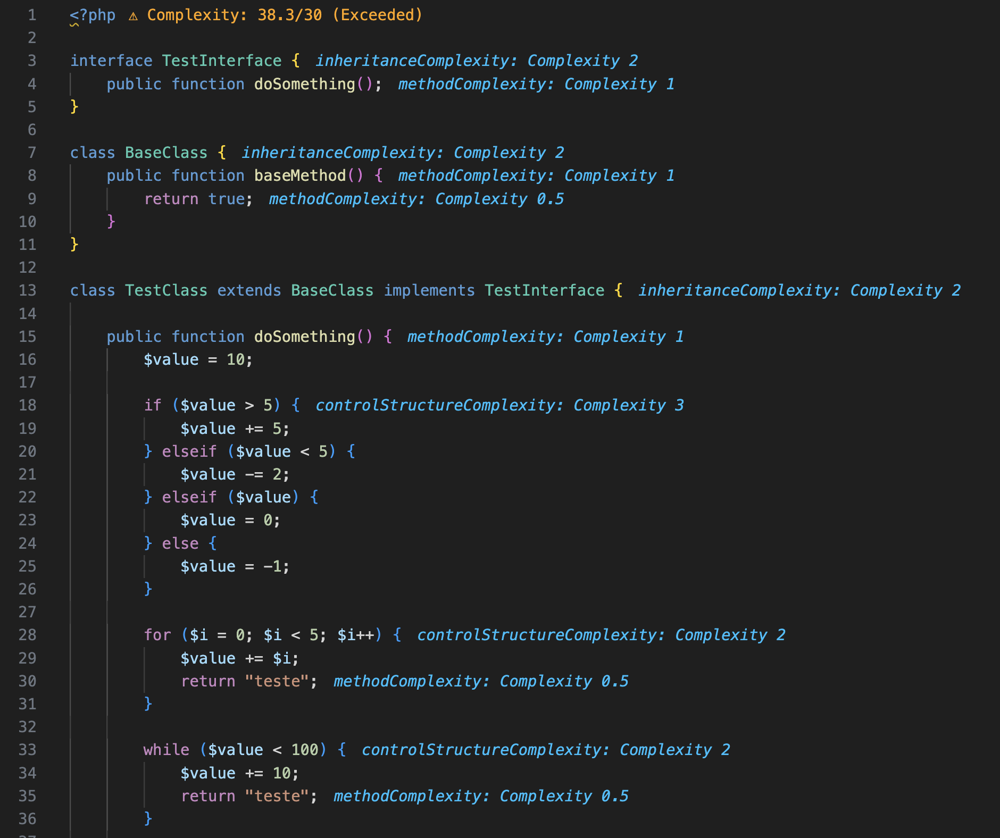

# **PHP Cognitive Complexity Analyzer**

📌 **Análise de complexidade cognitiva para PHP baseada no Cognitive Driven Development (CDD).**  
🚀 **Ajuda a visualizar e reduzir a complexidade do código diretamente no VS Code!**

---

## **📌 Recursos**
✅ **Análise de complexidade cognitiva para PHP** com base no **CDD**.  
✅ **Notações visuais no código**, indicando a complexidade de cada estrutura.  
✅ **Coloração dinâmica da aba do arquivo** no VS Code:  
   - 🔵 **Azul:** Complexidade dentro do limite.  
   - 🟠 **Laranja:** Complexidade excedida.  
✅ **Mensagens multilíngues** (**Português e Inglês**).  
✅ **Configuração personalizável via JSON**, permitindo ajuste dos pesos de complexidade.  

### **🔍 Exemplo de Notação Visual**


---

## **📥 Instalação**
### 📌 **Pelo VSCode Marketplace (OPÇÃO AINDA NÃO DISPONÍVEL)**
1. Acesse [VSCode Marketplace](https://marketplace.visualstudio.com/).
2. Busque por **PHP Cognitive Complexity Analyzer**.
3. Clique em **Instalar**.

### 📌 **Instalação Manual via VSIX**
1. Baixe o arquivo `.vsix` do repositório.
2. No VSCode, vá em **Extensões (`Ctrl + Shift + X`)**.
3. Clique no **menu de três pontos** `⋮` e escolha **"Instalar do VSIX..."**.
4. Selecione o arquivo `.vsix`.

---

## **⚙️ Configuração**
### **Configuração no VS Code**
Esta extensão adiciona as seguintes configurações:

| Configuração | Tipo | Padrão | Descrição |
|-------------|------|--------|-----------|
| `phpComplexityAnalyzer.language` | `string` | `"en"` | Define o idioma das mensagens da extensão (`"pt"` para Português e `"en"` para Inglês). |

### **📌 Como Alterar as Configurações**
1️⃣ **Abrir o VS Code**  
2️⃣ Ir para **"Configurações"** (`Ctrl + ,` no Windows/Linux ou `Cmd + ,` no macOS). Ou "File" -> "Preferences" -> "Settings".
3️⃣ Procurar por **"PHP Complexity Analyzer"** e modificar os valores.  
4️⃣ **Alternativamente**, edite o arquivo `settings.json`:

```json
{
    "phpComplexityAnalyzer.language": "en"
}
```

---

## **📜 Como Usar**
1. **Abra um arquivo PHP** no VS Code.  
2. **Execute o comando** `Analyze PHP Complexity` (`Ctrl + Shift + P`).  
3. **Veja a complexidade calculada**:
   - Notações ao lado do código.
   - Diagnósticos no **"Problemas" (`Ctrl + Shift + M`)**.
   - Coloração da aba do arquivo.

---

## **📂 Estrutura do Projeto**
📌 **Organização do código para desenvolvedores**:

php-cognitive-complexity-analyser/
```sh
│── .vscode/                        # Configurações para depuração
│── src/                            # Código-fonte da extensão
│   ├── config/                         # Configuração do usuário para a extensão (complexity-config.json arquivo padrão)
│   ├── messages/                       # Menssagens multilíngues (Strategy Pattern)
│   ├── analysis/                       # Análise de complexidade e validação da configuração
│   ├── extension.ts                    # Arquivo principal da extensão
│   ├── test/                            # Testes unitários
│── images/                         # Capturas de tela para README
│── package.json                    # Configuração da extensão
│── tsconfig.json                   # Configuração do TypeScript
│── README.md                       # Documentação do GitHub
│── .gitignore                      # Arquivos ignorados pelo Git
```

---

## **🛠️ Desenvolvimento**
### **📌 Como Rodar Localmente**
1️⃣ **Clone o repositório**:
```sh
git clone https://github.com/seu-repositorio/php-cognitive-complexity-analyzer.git
cd php-cognitive-complexity-analyzer
```
2️⃣ **Instale as dependências**:
```sh
npm install
```
3️⃣ **Inicie a extensão no modo de desenvolvimento**:
```sh
npm run watch
```
### **📌 Como Rodar os Testes Unitários**
```sh
npm run test
```

---

## **⚠️ Situações específicas**
1. A AST não identifica elseif diretamente, então a extensão percorre o nó if para calcular corretamente a complexidade do elseif, somando os pesos de if e elseif.
2. A AST não identifica o catch diretamente, então a extensão percorre o nó try para calcular corretamente a complexidade dos elementos dentro do try, como um return, somando os pesos junto com o peso do try.
3. A complexidade de operadores lógicos e aritméticos é calculada apenas em variáveis (pode ser expandido no futuro) e são tem os pesos somados para resumiur a notação apresentada ao lado da variável.
4. Configuração personalizada via JSON é obrigatória para o funcionamento adequado da análise.

---

# **📌 Release Notes - PHP Cognitive Complexity Analyzer**

🚀 **Histórico de versões e melhorias da extensão**.  

---

## **📌 Versão 1.0.0 - Lançamento Inicial**
📅 **Data de Lançamento:** *DD/MM/AAAA*  
🚀 **Primeira versão da extensão com funcionalidades principais**:
- 🎯 **Análise de complexidade cognitiva** baseada no **CDD (Cognitive Driven Development)**.
- 🎨 **Notações visuais ao lado do código** para indicar complexidade.
- 🟠 **Coloração da aba do arquivo no VS Code**:
  - 🔵 **Azul:** Complexidade dentro do limite.
  - 🟠 **Laranja:** Complexidade excedida.
- 📑 **Configuração via JSON** para definir pesos de complexidade (pesos são personalizáveis).
- 🌍 **Suporte a dois idiomas no retorno de mensagens da extensão** (**Português e Inglês**).
- 🛠️ **Diagnósticos integrados ao VS Code (`Ctrl + Shift + M`)**.

---

## **📌 Próximas Atualizações**
📌 **O que vem por aí?**  
🔄 **Melhorias na análise de complexidade para outras estruturas**.  
📈 **Suporte aprimorado para operadores e expressões complexas**.  

🚀 **Sugestões? Relate no GitHub!** [**github.com/seu-repositorio**](https://github.com/)  

---

## **📌 Feedback e Suporte**
📌 **Encontrou um bug ou tem sugestões?**  
🔗 **[Abra uma issue no GitHub](https://github.com/seu-repositorio/issues)**  
📩 **Entre em contato** pelo e-mail: `contato@seuprojeto.com`

---

**Obrigado por usar o PHP Cognitive Complexity Analyzer!** 🎯🚀
